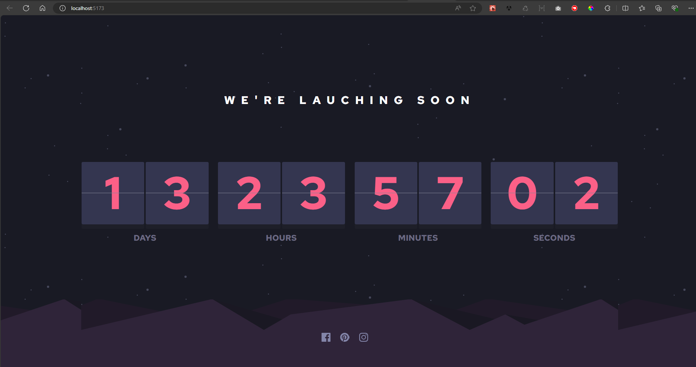

# Frontend Mentor - Launch countdown timer solution

This is a solution to the [Launch countdown timer challenge on Frontend Mentor](https://www.frontendmentor.io/challenges/launch-countdown-timer-N0XkGfyz-). Frontend Mentor challenges help you improve your coding skills by building realistic projects.

## Table of contents

- [Overview](#overview)
  - [The challenge](#the-challenge)
  - [Screenshot](#screenshot)
  - [Links](#links)
- [My process](#my-process)
  - [Built with](#built-with)
  - [What I learned](#what-i-learned)
  - [Continued development](#continued-development)
- [Author](#author)

## Overview

### The challenge

Users should be able to:

- See hover states for all interactive elements on the page
- See a live countdown timer that ticks down every second (start the count at 14 days)
- **Bonus**: When a number changes, make the card flip from the middle

### Screenshot

### Links

- Solution URL: [solution](https://github.com/dsaints2344/countdown-timer)
- Live Site URL: [live site](https://countdown-timer-seven-nu.vercel.app/)

## My process

### Built with

- [React](https://reactjs.org/) - JS library
- [ChakraUI](https://v2.chakra-ui.com/) - For styles and components
- [React-Flip-Countdown](https://www.npmjs.com/package/@leenguyen/react-flip-clock-countdown) - For timer component

### What I learned

Well, for this challenge, another approach for responsive design, which is the utilization of viewport units (which is a controversial approach), but given the use case for this project. I wanted to explore another approach.

### Continued development

I would like to familiarize better with a mobile first development workflow, which I might implement, by development, either with ionic (angular) or react native.

## Author

- Website - [Add your name here](https://dev-portafolio-three.vercel.app/)
- Frontend Mentor - [@dsaints2344](https://www.frontendmentor.io/profile/dsaints2344)
